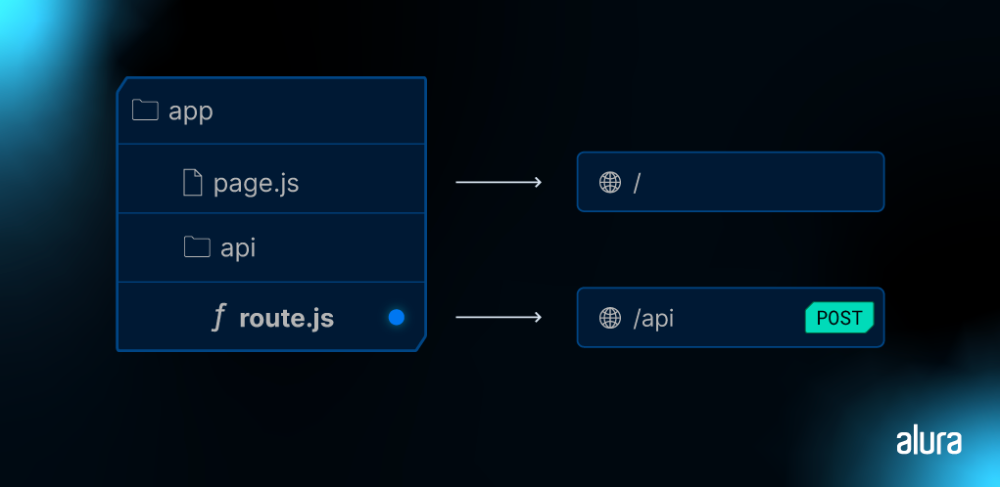

# Next.js: construindo com Server Actions

## Aula 01 - Evoluindo o Banco de dados

### Aula 01 - Apresentação - Vídeo

Nessa aula, vamos dar início a uma nova etapa do nosso projeto Code Connect, utilizando o Next.js e o Prisma. Nosso objetivo é adicionar interatividade ao projeto, permitindo que as pessoas usuárias curtam, comentem e respondam aos comentários dos posts.

Para isso, vamos aprimorar o banco de dados, ajustar a aplicação e adicionar novos componentes, tanto do lado do servidor quanto do cliente.

Você vai aprender a interagir com a pessoa usuária de diversas maneiras, combinando as funcionalidades do React e do Next, e aumentando a produtividade do seu desenvolvimento.

Se você já tem experiência com React, PostgreSQL e Docker, está pronto para essa jornada!

### Aula 01 - Migration e Comentários - Vídeo

Olá! Nessa aula, aprendemos a adicionar a funcionalidade de comentários no nosso projeto Code Connect. Começamos analisando a estrutura dos comentários, que podem ser associados a posts ou a outros comentários, criando uma hierarquia.

Em seguida, criamos o modelo Comment no Prisma, definindo campos como text, createdAt, updatedAt, authorId, postId e parentId.

Para estabelecer o relacionamento entre os modelos, criamos relações entre Comment e User, Comment e Post, e também um relacionamento auto-referencial entre Comment e Comment para representar a hierarquia de comentários.

Por fim, adicionamos o campo likes ao modelo Post para contabilizar os likes de cada post.

Com o esquema atualizado, executamos a migração no Prisma para atualizar o banco de dados e estamos prontos para implementar a funcionalidade de comentários no nosso projeto!

### Aula 01 - Server Action - Vídeo

Nessa aula, aprendemos a criar uma Server Action no Next.js para atualizar o número de likes de um post no banco de dados.

Começamos criando uma função assíncrona chamada incrementThumbsUp() que recebe um objeto post como parâmetro. Dentro da função, usamos o Prisma para atualizar o número de likes no banco de dados, utilizando o método update e o operador increment.

Também aprendemos a adicionar um comentário no início do arquivo para indicar que estamos lidando com ações do lado do servidor, usando 'use server'.

Por fim, fizemos alguns ajustes no CodeConnect, implementando um link para a página inicial no componente Aside e adicionando ações clicáveis dentro do componente CardPost.

Com isso, estamos prontos para implementar a contagem de likes e os comentários em cada post!

### Aula 01 - Para saber mais: Prisma - Migrations e Relations

#### Migrations

O Prisma oferece duas principais formas de lidar com migrações: prisma migrate dev e prisma migrate prod.

- prisma migrate dev
Utilizado principalmente em ambiente de desenvolvimento:

Cria novas migrações a partir de mudanças no schema Prisma.
Aplica automaticamente as migrações no banco de dados.
Gera arquivos SQL para cada migração.
É ideal para iterar rapidamente sobre o modelo de dados sem a preocupação imediata com a produção.

- prisma migrate prod
Focado em ambientes de produção:

Não gera novas migrações.
Precisa que as migrações sejam geradas antecipadamente (via prisma migrate dev ou manualmente).
Aplica as migrações pendentes no banco de dados de produção de forma segura.
A principal diferença entre os dois modos é que prisma migrate prod é projetado para ser usado em um pipeline de CI/CD, garantindo que as migrações aplicadas sejam revisadas e testadas antes de serem aplicadas em produção.

- Relacionamento um-para-um
No Prisma, um relacionamento um-para-um é representado por duas tabelas que têm uma referência direta entre si. Aqui está um exemplo prático:

```Prisma
model User {
  id        Int @id @default(autoincrement())
  profile   Profile?
}
model Profile {
  id      Int @id @default(autoincrement())
  userId  Int @unique
  user    User @relation(fields: [userId], references: [id])
}
```

Neste exemplo, cada User pode ter no máximo um Profile, e cada Profile está associado a exatamente um User.

- Relacionamento um-para-muitos
Um relacionamento um-para-muitos é talvez o tipo mais comum de relacionamento. Ele permite que um registro em uma tabela esteja associado a múltiplos registros em outra tabela. Veja como isso é feito:

```Prisma
model Post {
  id       Int @id @default(autoincrement())
  title    String
  authorId Int
  author   User @relation(fields: [authorId], references: [id])
}
model User {
  id    Int @id @default(autoincrement())
  posts Post[]
}
```

Neste caso, um User pode ter vários Posts, mas cada Post está vinculado a apenas um User. Exatamente como fizemos no Code Connect.

- Relacionamento muitos-para-muitos
Relacionamentos muitos-para-muitos requerem uma tabela de junção ou intermediária e o Prisma simplifica a criação desses relacionamentos:

```Prisma
model Post {
  id      Int      @id @default(autoincrement())
  title   String
  tags    Tag[]    @relation("PostToTag")
}
model Tag {
  id      Int      @id @default(autoincrement())
  name    String
  posts   Post[]   @relation("PostToTag")
}
// Tabela de junção explícita
model PostToTag {
  post    Post @relation(fields: [postId], references: [id])
  postId  Int
  tag     Tag @relation(fields: [tagId], references: [id])
  tagId   Int
  @@id([postId, tagId])
}
```

Com esse modelo, Posts e Tags podem ter várias instâncias associadas entre si, através de uma tabela de junção chamada PostToTag.

- Auto relacionamento
Vamos mergulhar mais fundo no nosso model de Comment:

```Prisma
model Comment {
  id         Int       @id @default(autoincrement())
  text       String
  createdAt  DateTime  @default(now())
  updatedAt  DateTime  @updatedAt
  authorId   Int
  author     User      @relation(fields: [authorId], references: [id])
  postId     Int
  post       Post      @relation(fields: [postId], references: [id])
  parentId   Int?
  parent     Comment?  @relation("CommentChildren", fields: [parentId], references: [id])
  children   Comment[] @relation("CommentChildren")
}
```

Aqui, cada comentário pode ser pai de outros comentários (children) e, ao mesmo tempo, ser filho de um comentário (parent). Esse padrão é essencial para criar uma árvore de comentários, permitindo uma estrutura de discussão aninhada.

O campo parentId é opcional (Int?), indicando que um comentário pode não ter um comentário pai (ou seja, é um comentário de primeiro nível). A relação @relation("CommentChildren") é usada para vincular parent a children, demonstrando o uso de uma relação nomeada para auto relacionamentos.

O auto relacionamento adiciona uma camada de profundidade e complexidade ao modelo de dados. Ele permite que estruturas recursivas sejam representadas em um banco de dados relacional, sem a necessidade de tabelas adicionais para gerenciar a hierarquia.

Essas estruturas são comuns em aplicações modernas, especialmente onde a interação do usuário e a organização de conteúdo são complexas e aninhadas. A capacidade de modelar tais relações diretamente no banco de dados simplifica o desenvolvimento e a manutenção dessas aplicações.

### Aula 01 - Nessa aula, você aprendeu como`:`

- Evoluir o banco de dados de uma aplicação existente, utilizando o Prisma;
- Criar auto relacionamentos;
- Criar queries do Prisma usando o increment.

## Aula 02 - Server Action e Client Components

### Aula 02 - Montando o formulário - Vídeo

Nessa aula, começamos a desenvolver o formulário de curtidas (ThumbsUp) para o nosso back-end.

Primeiro, criamos um componente ThumbsUp com uma marcação SVG para o ícone. Depois, criamos um componente IconButton que renderiza um botão com o ícone e recebe as props do botão HTML.

Em seguida, implementamos os estilos do IconButton usando CSS module.

No card post, adicionamos o IconButton dentro de um form para enviar a curtida para o back-end. Também adicionamos um parágrafo para exibir a contagem de likes.

Por fim, ajustamos o layout do card post usando CSS para centralizar o texto da contagem de likes e espaçar os elementos do footer.

### Aula 02 - Enviando Likes - Vídeo

Nessa aula, aprendemos a conectar o botão de curtir ao nosso formulário e implementar a funcionalidade de curtir um post.

Primeiro, usamos a propriedade action do formulário para indicar a server action que será executada ao enviar o formulário.

Depois, usamos o método .bind() para passar o post como parâmetro para a função incrementThumbsUp, que incrementa o número de curtidas do post.

Para garantir que a página seja recarregada após a atualização do número de curtidas, usamos a função revalidatePath() do Next.js.

Essa função permite que o Next.js recarregue a página tanto na homepage quanto na página do post.

### Aula 02 - Estado do Fomulário - Vídeo

Nessa aula, aprendemos a implementar um indicador de carregamento (Spinner) para mostrar à pessoa usuária que a curtida está sendo processada.

Primeiro, criamos um componente Spinner com CSS para o visual do carregamento. Depois, criamos um componente ThumbsUpButton para encapsular o botão de curtir e o Spinner.

Utilizamos o useFormStatus do react-dom para saber se o formulário está sendo submetido. Com isso, podemos exibir o Spinner enquanto o formulário está sendo processado e o botão de curtir fica desabilitado.

Por fim, aprendemos a usar o await new Promise para simular um tempo de espera na função update do lado do servidor, mostrando como o Spinner funciona na prática.

### Aula 02 - Para saber mais: o método bind

#### Mas afinal, o que esse método faz?

O método .bind() é usado para definir o contexto this de uma função, independentemente de como ela é chamada. Em outras palavras, .bind() permite que você fixe ou "amarre" (por isso o "bind") o valor de this para a função, garantindo que ele seja o mesmo, não importa como ou onde a função seja invocada.

JavaScript é uma linguagem de programação muito flexível, mas isso pode levar a problemas de contexto. O valor de this dentro de uma função depende de como a função é chamada. Isso pode causar confusão, especialmente em callbacks e eventos, onde o contexto pode mudar inesperadamente.

#### Tá, mas porque ele foi criado?

O método .bind() está disponível a partir do ECMAScript 5 e foi criado para resolver exatamente esse problema: proporcionar uma maneira de manter o contexto this consistente, independentemente do contexto de execução da função. Isso é útil em situações onde o contexto é faz a diferença na lógica da aplicação, como manipulação de eventos, callbacks assíncronos e quando trabalhamos com classes e métodos em JavaScript (como os Class Components, utilizados em versões mais antigas do React).

Como ele funciona na prática:
Vamos entender como o .bind() funciona:

```JavaScript
const person = {
  name: "João",
  greet: function() {
    console.log("Olá, " + this.name);
  }
};
person.greet(); // Saída: "Olá, João"
const greet = person.greet;
greet(); // Saída: "Olá, " - porque 'this' não está definido fora do contexto de 'person'
```

No exemplo acima, quando chamamos greet() diretamente, o contexto this se perde. Aqui é onde .bind() brilha:

```JavaScript
const boundGreet = person.greet.bind(person);
boundGreet(); // Saída: "Olá, João"
```

Ao usar .bind(person), fixamos o contexto de this para person, garantindo que name seja reconhecido independentemente de como greet é chamada.

#### Casos de uso comuns

Manipulação de eventos: Em frameworks nós frequentemente passamos métodos de um componente como callbacks para eventos. Usar .bind() garante que o método mantenha o contexto correto do componente.

```JavaScript
document.getElementById("meuBotao").addEventListener("click", this.handleClick.bind(this));
```

Callbacks assíncronos: Ao trabalhar com Promises ou funções assíncronas, o .bind() pode ser usado para assegurar que o contexto dentro dos callbacks seja o esperado.

Programação funcional: Aqui o .bind() é útil para criar versões parcialmente aplicadas de funções, permitindo a reutilização de lógicas de função com diferentes contextos.

### Aula 02 - Nessa aula, você aprendeu como`:`

- Revalidar o cache do Next com a função revalidatePath;
- Pré-definir parâmetros usando o método bind;
- Implementar client components e utilizar o hook useFormStatus.

## Aula 03 - Adicioando Comentários

### Aula 03 - Criando a Modal - Vídeo 1

Nessa aula, começamos a construir os componentes para adicionar comentários ao CodeConnect.

Criamos uma modal, que é uma caixa de diálogo, para exibir os comentários. A modal é um componente do lado do cliente, pois precisa de um estado local para controlar se está aberta ou fechada.

Para isso, usamos o hook forwardRef para expor uma referência que permite abrir e fechar a modal.

Criamos métodos closeModal e openModal para controlar o estado da modal.

Também usamos o hook useImperativeHandle para expor esses métodos para quem consumir o componente.

Por fim, criamos um cabeçalho para a modal com um botão de fechar.

O desafio da aula é estilizar a modal para que ela fique como no Figma.

### Aula 03 - Implementando Modal de comentários - Vídeo 2

Nesta aula, aprendemos a implementar uma modal de comentários no nosso projeto Next.js. Começamos adicionando estilos para a modal no arquivo globals.css e modal.module.css.

Em seguida, criamos um novo componente chamado ModalComment que contém a modal e um botão para abri-la. O botão utiliza o componente IconButton com um ícone de chat.

Conectamos a modal ao componente CardPost para que ela seja exibida ao lado do botão de curtir. Para isso, incluímos os comentários na query do banco de dados.

No final, testamos a aplicação e verificamos se a modal está funcionando corretamente.

Agora, vamos continuar construindo os componentes da modal de comentários, como o título, a área de texto e o botão de enviar!

### Aula 03 - Server Actions e Mutations - Vídeo 3

Nessa aula, aprendemos a criar uma função postComment() para adicionar comentários em nosso projeto Next.js. Essa função recebe o post e os dados do formulário como argumentos.

Primeiro, definimos a autora do comentário como "anabeatriz_dev" usando o Prisma para buscar o usuário no banco de dados. Em seguida, criamos o comentário usando db.comment.create(), passando o texto do comentário, o ID da autora e o ID do post.

Para atualizar o cache do Next.js e garantir que as alterações sejam refletidas na interface, usamos revalidatePath() para revalidar o caminho da página principal e da página do post.

Por fim, incluímos a Textarea na modal de comentários e preparamos o terreno para criar um botão reutilizável que exibirá um spinner enquanto o formulário estiver sendo submetido.

Essa aula foi um passo importante para construir a funcionalidade de comentários em nosso projeto. Agora, você está pronto para criar o botão e estilizar a Textarea!

### Aula 03 - Nessa aula, você aprendeu como`:`

- Implementar o useImperativeHandle;
- Combinar Server Actions e Client Components;
- Utilizar o método create do Prisma.

## Aula 04 - Respondendo Comentários

### Aula 04 - Exibindo os comentários - Vídeo 1

Olá! Nessa aula, aprendemos a exibir os comentários em nossa página de posts. Começamos criando um componente chamado Comment que exibe o avatar, o nome do autor e o texto do comentário. Depois, criamos um componente CommentList que itera sobre a lista de comentários e renderiza cada um deles usando o componente Comment.

Para garantir que os autores dos comentários fossem incluídos, modificamos o getPostBySlug para incluir o author nos comentários.

No final, vimos como a página de posts ficou com os comentários exibidos.

Agora, o desafio é estilizar a área de comentários e os comentários em si, usando o Figma como referência. Depois, vamos começar a desenvolver a funcionalidade de resposta aos comentários!

### Aula 04 - Respondendo via server action - Vídeo 1

Nessa aula, aprendemos a criar uma Server Action para responder comentários em nosso blog.

Vimos que, ao invés de reutilizar a função de postar um comentário com um if e else, é melhor criar uma função separada chamada postReply para lidar especificamente com as respostas.

A função postReply recebe o post e o comentário pai como parâmetros. Para garantir que as respostas fiquem organizadas, usamos o parentId do comentário pai para determinar o nível de aninhamento. Se o comentário pai tiver um parentId, usamos esse valor. Caso contrário, usamos o id do comentário pai.

Essa estrutura de dados nos permite manter o primeiro nível de comentários sempre alinhado e as respostas aninhadas corretamente.

No final da aula, você recebeu um desafio para criar um componente ModalReply que permite responder a um comentário. Esse componente é muito parecido com a modal de comentário, mas usa a Server Action postReply para enviar a resposta.

Lembre-se de que a modelagem de dados é fundamental para o desenvolvimento full-stack. Explore a atividade na plataforma para se aprofundar nesse assunto!

### Aula 04 - Nullish Coalescing Operator (exercício)

Considerando a necessidade de atribuir um valor padrão de R$50,00 para as obras cujo preço não foi especificado pelo artista, qual das seguintes implementações do Nullish Coalescing Operator é a mais adequada para alcançar esse objetivo?

```JavaScript
const precoFinal = precoObra ?? 50;
```

Esta é a implementação correta do Nullish Coalescing Operator. Ela atribui o valor de precoObra a precoFinal se precoObra não for null ou undefined. Caso contrário, atribui 50. Isso garante que o preço padrão seja R$50,00 quando o artista não especificar um preço.

### Aula 04 - Nessa aula, você aprendeu como`:`

- Manipular a inclusão de comentários aninhados;
- Operador ?? (Nullish Coalescing Operator);
- Pensamento crítico para organizar a estrura visual em componentes reaproveitáveis.

## Aula 05 - Finalizando a aplicação

### Aula 05 - Renderizando respostas - Vídeo 1

Nessa aula, aprendemos a renderizar respostas de comentários em nossa aplicação Next.js, utilizando o Prisma para buscar os dados do banco de dados.

Primeiro, ajustamos a consulta do Prisma para incluir apenas os comentários que não são respostas (ou seja, os comentários "pais"). Depois, modificamos o componente Replies para exibir as respostas de um comentário específico, usando renderização condicional.

Também aprendemos a adicionar um botão "Responder" para cada resposta, que abre uma modal para que o usuário possa escrever uma nova resposta.

Por fim, discutimos a importância de otimizar a performance da aplicação, evitando buscar todas as respostas de uma vez, e buscando-as apenas quando o usuário clicar em "Ver respostas".

### Aula 05 - Cuidados com a performance - Vídeo 2

Nessa aula, aprendemos como otimizar a performance da nossa aplicação Next.js ao buscar dados de forma dinâmica, evitando o carregamento de todos os dados de uma vez.

Para isso, usamos o useEffect do React para fazer um fetch de dados somente quando necessário, no caso, quando o usuário clica para ver as respostas de um comentário.

Criamos uma Route API no Next.js para retornar os dados em formato JSON, seguindo a estrutura de pastas e arquivos que definem a URL do endpoint.

Com essa estrutura, conseguimos fazer requisições HTTP para buscar os dados das respostas de um comentário específico, sem precisar carregar todos os comentários de uma vez.

No final, vimos como a aplicação funciona na prática, com a requisição sendo feita apenas quando o usuário clica para ver as respostas, e os dados sendo carregados de forma eficiente.

### Aula 05 - Para saber mais: APIs restful

Durante o curso, nós criamos uma rota para um endpoint de uma API, utilizando [Route Handlers](https://nextjs.org/docs/app/building-your-application/routing/route-handlers) do Next.js:  
  
Diagrama de estrutura de diretórios com arquivos 'page.js' e 'route.js' indicando suas rotas de acesso na aplicação.

```JavaScript
// src/app/api/comment/[id]/replies/route.js
import db from "../../../../../../prisma/db";
export async function GET (_request, { params }) {
    const replies = await db.comment.findMany({
        where: {
            parentId: parseInt(params.id)
        },
        include: {
            author: true
        }
    })
    return Response.json(replies)
}
```

E pegamos lá no nosso Client Component:

```JavaScript
    async function fetchData() {
        const response = await fetch(`/api/comment/${comment.id}/replies`)
        const data = await response.json()
        setReplies(data)
    }
```

Quando estávamos implementando isso, eu falei de Restful e REST. Uma API RESTful geralmente segue os seguintes princípios:

- Cliente-Servidor: uma separação clara entre cliente e servidor.
- Stateless: cada requisição do cliente para o servidor deve conter todas as informações necessárias para entender e completar a requisição. O servidor não armazena o estado do cliente.
- Cacheável: as respostas devem ser explícitas sobre a sua cacheabilidade para evitar que clientes reutilizem dados desatualizados ou inapropriados.
- Interface Uniforme:
  - Identificação de recursos: cada recurso é identificado por URIs.
  - Representação de recursos: os recursos são representados em um formato que pode ser facilmente manipulado pelo cliente (como JSON).
  - Mensagens auto-descritivas: as mensagens de requisição e resposta contêm metadados suficientes para descrever como processá-las.
  - HATEOAS (Hypermedia As The Engine Of Application State): as respostas da API incluem hiperlinks que permitem ao cliente descobrir outras ações e recursos disponíveis.
  - Sistema em camadas: a arquitetura pode incluir várias camadas intermediárias entre cliente e servidor para aumentar a escalabilidade, segurança, etc.

Se você quiser mergulhar mais fundo nesse universo, pode começar pelo artigo do Gui Lima: [REST: Conceito e fundamentos](https://www.alura.com.br/artigos/rest-conceito-e-fundamentos).

### Aula 05 - Nessa aula, você aprendeu como`:`

- Implementar uma rota GET utilizando o Route Handler;
- Buscar dados no servidor a partir do Client Component;
- Manipular includes aninhados do Prisma.

### Aula 05 - Conclusão - Vídeo 3

Nessa aula, finalizamos o curso "Next.js: construindo com Server Actions", onde evoluímos o Code Connect, nossa aplicação, adicionando funcionalidades como comentários, curtidas e respostas.

Utilizamos o Prisma para migrar o banco de dados e implementamos a funcionalidade de comentários, permitindo que os usuários visualizem, comentem, respondam comentários e até respondam respostas de comentários.

Também exploramos a estrutura de pastas da nossa aplicação, como app/api/comment/[id]/replies, e começamos a usar a conversão de nomes de uma API RESTful.

Agora, você pode publicar seu projeto, compartilhar nas redes sociais e nos marcar com a hashtag #AprendiNaAlura!
