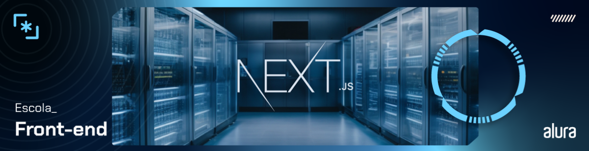

# Curso Alura Next.js: conheça o framework React

## Aula 1 - Criando o Projeto

### Aula 1 - Apresentação - Video 1

Nesta aula, o instrutor Vinny Neves apresentou o projeto "Code Connect" no Figma, que será desenvolvido ao longo do curso. Ele comparou o Next.js com o desenvolvimento de aplicações React que rodam no lado do cliente, destacando as principais diferenças e técnicas utilizadas pelo Next.js. O curso visa ensinar como listar posts de forma paginada e trabalhar na página de detalhes do post, além de abordar a transição do desenvolvimento no lado do cliente para o lado do servidor, explicando como o Next.js lida com o roteamento. É importante ter conhecimento prévio em React.js para acompanhar as aulas. Este é o primeiro curso a utilizar o projeto "Code Connect", com a promessa de mais cursos futuros.

### Aula 1 - Preparando o projeto - Video 2

Nesta aula, o instrutor abordou o processo de programação e transformação do Code Connect de um simples desenho para uma aplicação funcional utilizando o framework Next.js. Ele explicou o processo de instalação do Next.js, recomendando o uso do comando npx create-next-app@14 para configurar a aplicação na versão 14 do Next. Em seguida, mostrou como testar e rodar a aplicação no ambiente de desenvolvimento, utilizando o comando npm run dev e acessando a URL `http://localhost:3000`. Posteriormente, foi feita uma limpeza no projeto no editor de código VS Code, removendo estilos globais e realizando ajustes no layout padrão fornecido pelo Next.js. Por fim, foram feitas algumas modificações no código, como a troca do título e descrição da aplicação, configuração do idioma para português brasileiro, e exclusão de imagens desnecessárias. O vídeo também destacou a importância de verificar possíveis erros no console do navegador e no terminal, devido ao funcionamento do Next.js com renderização do lado do servidor. Ao final, foi ressaltado que a aplicação base foi criada e limpa, permitindo evoluir o projeto Code Connect.

### Aula 1 - Criando o componente Aside - Video 3

Nesta aula, o instrutor ensina como estilizar uma aplicação web utilizando o Figma como referência para o design. Primeiramente, é feita a estilização do body da página, definindo um gradiente linear de fundo, removendo margens e definindo uma altura mínima. Em seguida, é criado o componente Aside, que é um componente lateral contendo a logo da aplicação. A logo é inserida na pasta public e o componente é criado em React, seguindo boas práticas de organização de arquivos. Posteriormente, são utilizados os módulos CSS para estilizar o componente Aside, aplicando bordas arredondadas, cores de fundo e espaçamentos. A importação e aplicação dos estilos CSS são feitas de forma modular, garantindo que os estilos sejam aplicados apenas ao componente desejado. Ao final, é verificado no navegador o resultado da estilização, mostrando o componente Aside estilizado corretamente. O instrutor destaca a facilidade de uso dos CSS modules fornecidos pelo Next.js e deixa claro que ainda há mais tarefas a serem realizadas no próximo vídeo.

### Aula 1 - Componente Image do Next.js - Video 4

Nesta aula, foi abordada a montagem do layout de uma aplicação web utilizando CSS e Next.js. Inicialmente, foi mencionado o uso do Figma para definir o tamanho do frame da aplicação, com uma largura máxima de 1.200 pixels e margens de 56 pixels para cima e para baixo. Em seguida, foi mostrado o processo de montagem do layout da página no VSCode, criando uma div com o nome de app-container para envolver os componentes Aside e children. A estilização global foi feita no arquivo globals.css, definindo a largura, margens e display flex da app-container.

Além disso, foi abordada a otimização do carregamento de imagens com o Next.js, onde foi demonstrado como utilizar o componente Image do Next.js para substituir a tag img convencional. A imagem da logo foi movida para a pasta do componente Aside e importada no arquivo index.jsx, sendo utilizada no componente Image com a devida especificação do texto alternativo. Foram destacadas as vantagens de utilizar o Image para otimização automática das imagens.

Por fim, foi mencionado que na próxima aula será abordada a construção dos cards que representam as postagens na aplicação, indicando a continuidade do desenvolvimento do layout.

### Aula 1 - Para saber mais: apresentando o Next.js

Enquanto o React é uma das mais famosas bibliotecas focadas no desenvolvimento de interfaces com as pessoas usuárias, o Next.js é um framework que estende as funcionalidades do React e nos permite construir aplicações fullstack.

Neste curso, vamos mergulhar na versão 14 do Next.js e desvendar suas funcionalidades padrão. É como abrir uma caixa de ferramentas cheia de recursos prontos para uso.

Esse framework que adiciona superpoderes ao React foi criado e é mantido pela [Vercel](https://vercel.com/).

Eu vou deixar aqui pra você o link pro artigo que eu escrevi que explica os principais conceitos do [Next.js:](https://www.alura.com.br/artigos/next-js). Nele a gente conversa sobre muita coisa bacana que o Next.js oferece pra gente, então sinta-se à vontade para ler e revisar sempre que necessário.

### Aula 1 - Nessa aula, você aprendeu como`:`

- Criar aplicações Next.js utilizando o npx;
- Estilizar componentes utilizando CSS Modules;
- Lidar com imagens na pasta public;
- Otimizar o uso das imagens utilizando o componente Image do Next.js.

## Aula 2 - Criando um Crad para os posts

### Aula 2 - Estruturando de forma semântica - Video 1
